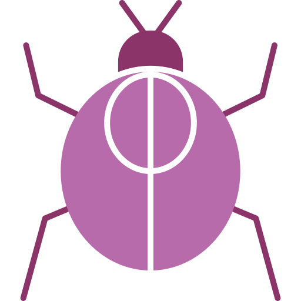

<h1> Smart Insect Monitoring (Real Time Detection, Classification and Risk Assessment)</h1>

## Project Overview

Smart Insect Detection is a comprehensive computer vision system designed to detect, classify, track, and assess the risk level of insects in real-time through video feeds or images. This multi-model approach combines state-of-the-art object detection, precise classification, and advanced tracking to create a powerful tool for insect monitoring and risk assessment.

## Key Features

### 🔍 Multi-Stage Detection & Classification
- **Object Detection**: Custom-trained YOLOv8 model identifies insects in video frames
- **Classification Pipeline**: Four different deep learning models for accurate species identification
  - VGG16
  - InceptionV3
  - MobileNetV3
  - ResNet50
- **Six Insect Classes**: Bee, Fly, Grasshopper, Lepi (butterfly/moth), Scorpion, Spider

### 🔄 Advanced Object Tracking
- **ByteTrack Algorithm**: Custom-implemented tracking for consistent insect monitoring
- **Kalman Filtering**: Predicts insect movements even when temporarily out of view
- **Trajectory Visualization**: Visual history of insect movements with unique IDs

### ⚠️ Risk Assessment System
- **Automatic Evaluation**: Real-time risk level determination based on insect species
- **Detailed Information**: Provides threat level and relevant information about detected insects

### 🖥️ User-Friendly Interface
- **Interactive Controls**: Adjust detection frequency and confidence thresholds
- **Visualization Options**: Live video feed with overlay information
- **Multiple Input Sources**: Support for webcam feeds or video files
- **Single Image Analysis**: Option to classify insects from individual images

### 🧠 AI Model Flexibility
- Multiple pre-trained models with different architecture strengths
- High classification accuracy (97-99% across all models)
- Optimized performance for real-time operation

## System Architecture

### Detection Framework
The system uses YOLOv8, a state-of-the-art object detection model, for initial insect localization. This provides high-speed, accurate bounding boxes around insects in each frame.

### Classification Models
Four different classification models have been trained and evaluated for species identification:

1. **VGG16**
   - Fine-tuned with transfer learning
   - 99.00% overall accuracy
   - Excellent balance of accuracy and inference speed
   - **Selected as primary classification model** due to consistent train/validation loss values (~0.03 for both), indicating excellent generalization without overfitting

2. **InceptionV3**
   - Transfer learning approach
   - 99.32% overall accuracy
   - Strong performance on complex patterns
   - Despite highest accuracy, showed significant disparity between training loss (~3.0) and validation loss (~0.03), suggesting potential training instability

3. **MobileNetV3**
   - Lightweight architecture optimized for edge devices
   - 99.00% overall accuracy
   - Fastest inference time

4. **ResNet50**
   - Deep residual network with transfer learning
   - 96.69% overall accuracy
   - Strong feature extraction capabilities

### ByteTrack Tracking System
The custom ByteTrack implementation includes:
- High-confidence association step for reliable tracking
- Low-confidence association step to prevent losing insects
- Kalman filter for motion prediction and trajectory smoothing
- Unique ID assignment and management for each insect

## Performance Metrics

### Classification Accuracy

| Model       | Accuracy | Precision | Recall | F1-Score |
|-------------|----------|-----------|--------|----------|
| VGG16       | 99.02%   | 99.03%    | 98.98% | 99.00%   |
| InceptionV3 | 99.34%   | 99.33%    | 99.28% | 99.32%   |
| MobileNetV3 | 98.42%   | 99.00%    | 99.00% | 98.50%   |
| ResNet50    | 96.92%   | 96.89%    | 96.57% | 96.69%   |

### Detailed Model Comparison

| Model       | Train F1 Score | Val F1 Score | Train Loss | Val Loss | Epochs | Training Time |
|-------------|----------------|--------------|------------|----------|--------|---------------|
| VGG16       | 0.9710         | 0.9900       | 0.0029     | 0.0384   | 10     | 130 min       |
| InceptionV3 | 0.9912         | 0.9932       | 3.4000     | 0.0314   | 10     | 20 min        |
| MobileNetV3 | 0.9988         | 0.9850       | 0.0045     | 0.0610   | 20     | 21 min        |
| ResNet50    | 0.9279         | 0.9669       | 0.1925     | 0.1173   | 10     | 40 min        |

> **Note:** Detailed visualizations including confusion matrices, classification reports, and training history graphs for each model are available in the `reports/` directory. These visualizations provide deeper insights into model performance across different insect classes.

## Project Structure

```
Smart_Insect_Detection/
├── app/                         # Main application
│   ├── insect_detection_app.py  # Main PyQt5 application interface
│   ├── insect_detection_classification.py # Standalone detection script
│   ├── bytetrack.py             # ByteTrack implementation for tracking
│   ├── requirements.txt         # Python dependencies
│   └── README.md                # Application documentation
│
├── models/                      # All AI models
│   ├── vgg16/                   # VGG16 model
│   ├── inception_v3/            # InceptionV3 model
│   ├── mobile_net_v3/           # MobileNetV3 model
│   └── res_net_50/              # ResNet50 model
│
├── datasets/                    # Dataset repository
│   ├── bee/                     # Bee images
│   ├── fly/                     # Fly images
│   ├── grasshopper/             # Grasshopper images
│   ├── lepi/                    # Butterfly/moth images
│   ├── scorpion/                # Scorpion images
│   └── spider/                  # Spider images
│
├── weights/                     # Trained model weights
│   ├── yolo/                    # YOLO weights (best.pt)
│   ├── vgg16/                   # VGG16 weights
│   ├── inception_v3/            # InceptionV3 weights
│   ├── mobile_net_v3/           # MobileNetV3 weights
│   └── res_net_50/              # ResNet50 weights
│
└── reports/                     # Results and reports
    ├── vgg16/                   # VGG16 results
    ├── inception_v3/            # InceptionV3 results
    ├── mobile_net_v3/           # MobileNetV3 results
    └── res_net_50/              # ResNet50 results
```

## Dataset

### Overview
The dataset used in this project contains high-quality images of six insect classes: bee, fly, grasshopper, lepi (butterfly/moth), scorpion, and spider. It was carefully curated by combining and preprocessing multiple existing datasets to ensure diversity and comprehensive coverage of various insect species.

Each class contains approximately 1600-2100 training images, resulting in a well-balanced dataset that helps prevent model bias. The dataset features insects in various poses, backgrounds, and lighting conditions to ensure robust model performance in real-world scenarios.

### Dataset Download
The complete dataset is not included in the repository due to size constraints. You need to download it separately and place it in the `datasets/` directory:

[Download Insect Classification Dataset](https://drive.google.com/drive/folders/1svHkaUlSPY54MoS4E_KBTY-6yLWXkPJa?usp=sharing)

### Dataset Sources
This dataset was compiled from various sources, including:
- [IP102: A Large-Scale Benchmark Dataset for Insect Pest Recognition](https://github.com/xpwu95/IP102)
- [Insect Classification Dataset on Kaggle](https://www.kaggle.com/datasets/shamelessbaboon/insect-classification-dataset)
- [Insects Images Dataset for Classification](https://www.kaggle.com/datasets/shreyasvedpathak/insects-images-dataset-for-classification)

### Dataset Statistics
- Total images: ~9.000
- Training images: ~7200
- Validation images: ~1800
- Image resolution: Varies, standardized to 224×224 during preprocessing
- Format: RGB images in JPG/PNG format

## Installation Guide

### Prerequisites
- Python 3.8 or higher
- CUDA-compatible GPU (recommended for optimal performance)

### Setup Steps

1. Clone the repository:
   ```bash
   git clone https://github.com/username/Smart-Insect-Detection.git
   cd Smart-Insect-Detection
   ```

2. Create a virtual environment (recommended):
   ```bash
   python -m venv venv
   # On Windows
   venv\Scripts\activate
   # On Linux/Mac
   source venv/bin/activate
   ```

3. Install dependencies:
   ```bash
   pip install -r app/requirements.txt
   ```

4. Download model weights (if not included in repository):
   - YOLOv8 weights (`weights/yolo/best.pt`) 
   - Classification model weights (in respective directories under `weights/`)

## Usage Guide

### Running the GUI Application

1. Navigate to the app directory:
   ```bash
   cd app
   ```

2. Launch the application:
   ```bash
   python insect_detection_app.py
   ```

3. Using the interface:
   - Click "Webcam" to use your computer's camera
   - Click "Open Video" to analyze a video file
   - Click "Classify Image" to analyze a single image
   - Adjust the detection frequency slider for performance optimization
   - Adjust the confidence threshold to control detection sensitivity
   - Use the "Stop" button to end the detection session

### Understanding the Interface

- **Video Display**: Shows the live feed with detection boxes and information
- **Controls Panel**: Contains buttons and sliders for application control
- **Statistics**: Displays FPS and system status information
- **Detection Results**: Shows detected insects and their classification
- **Risk Assessment**: Displays threat level for detected insects

## Model Training

Each model directory contains training code and utilities. To train a specific model:

```bash
# For VGG16 model
cd models/vgg16
pip install -r requirements.txt
python trainer.py

# For InceptionV3 model
cd models/inception_v3
pip install -r requirements.txt
python train.py

# For MobileNetV3 model
cd models/mobile_net_v3
pip install -r requirements.txt
python main.py

# For ResNet50 model
cd models/res_net_50
pip install -r requirements.txt
python train.py
```

## Future Improvements

- Adding more insect classes for broader coverage
- Implementing temporal models (LSTM/GRU) for behavior analysis
- Supporting multi-camera setups for wide-area monitoring
- Creating a web interface for remote monitoring
- Adding automated alert system for high-risk insect detection

## License

This project is licensed under the MIT License - see the LICENSE file for details.

## Acknowledgments

- YOLO by Ultralytics
- PyTorch team for providing the deep learning framework
- ByteTrack authors for the tracking algorithm inspiration 
